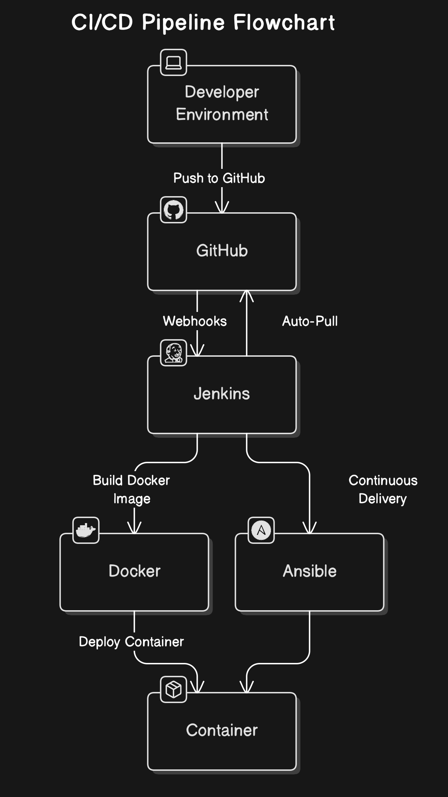

# CI/CD Pipeline Project Overview

This project demonstrates the creation of a CI/CD pipeline using GitHub, Jenkins, Ansible, and Docker on AWS. The pipeline automates the code deployment process, leveraging webhooks for real-time updates and integration.

## Summary

We create a CI/CD pipeline using GitHub, Jenkins, Ansible, and Docker on AWS, demonstrating automated code deployment with webhooks.

## Highlights

- 🚀 **CI/CD Pipeline Creation:** Build a seamless integration and deployment process.
- 📦 **Docker Integration:** Use Docker containers for efficient software packaging.
- 🌐 **GitHub Webhooks:** Automate triggering Jenkins from GitHub events.
- ☁️ **AWS Deployment:** Set up virtual machines on AWS for Jenkins and Ansible.
- ⚙️ **Ansible Playbook:** Automate container deployment using Ansible.
- 🔄 **Real-Time Updates:** Modify code in GitHub to see instant updates in deployment.
- ✔️ **Error Handling:** Learn to troubleshoot common errors during setup.

## GitHub Repository and Pipeline Details

This project is hosted on GitHub at [https://github.com/bunnysayzz/ansible.git](https://github.com/bunnysayzz/ansible.git). The pipeline is configured to trigger automatically with GitHub webhooks, ensuring real-time deployment upon code changes. Jenkins is used as the CI/CD tool to automate the build and deployment process.

## Key Insights

- 🔄 **Importance of Automation:** Automating deployment processes minimizes human error and speeds up project delivery, enhancing efficiency.
- 📡 **Webhooks Significance:** GitHub webhooks allow for instantaneous communication between repositories and CI/CD tools, ensuring prompt code integration.
- 🏗️ **Infrastructure as Code:** Using tools like Ansible for automation promotes reproducibility and maintainability of server configurations.
- 🌍 **Cloud Flexibility:** Deploying on AWS provides scalability and flexibility, allowing for easy scaling as project needs grow.
- 🔧 **Containerization Benefits:** Docker encapsulates applications and their dependencies, ensuring consistency across various environments and simplifying deployment.
- 🛠️ **Continuous Learning:** Encountering and resolving errors during setup fosters a deeper understanding of the tools and technologies involved.
- 📈 **Version Control:** Utilizing GitHub as a version control system facilitates collaboration and tracking of changes, which is essential for team projects.

## Detailed Setup Explanation

For a more in-depth look at the setup process, including commands, refer to the following document: [https://res.cloudinary.com/dxecoctrm/image/upload/v1731218525/ghnp8xue2jndodl2iqha.pdf](https://res.cloudinary.com/dxecoctrm/image/upload/v1731218525/ghnp8xue2jndodl2iqha.pdf)